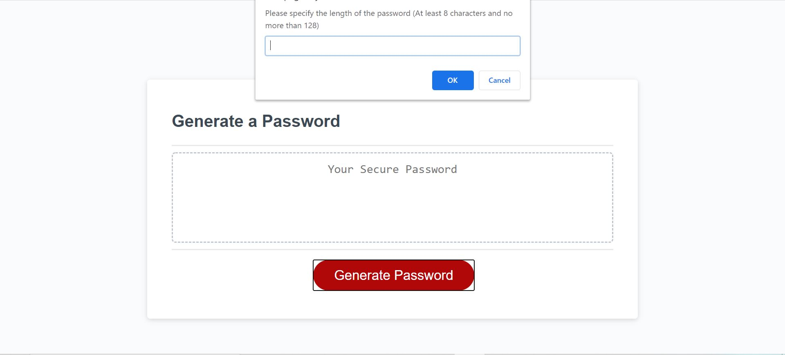
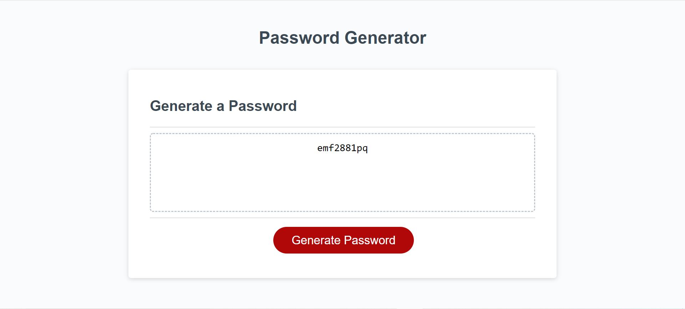

# JS-password-generator

## Goal of this project

The goal of this project is to create a password generator that generates a password based on user's criteria. The password has a minimum of 8 characters and a maximum of 128 characters. The user can choose to include lower case, upper case, numeric and/or special character.

## Usage

To open the web app, copy this link into browser's clipboard and enter:

https://linhgt.github.io/linh-bootcamp-password-generator/

### Technologies

HTML, CSS, Javascript. No other framework used

### How it works

The generator includes a text box that displays the final password and a generate password button. After the user clicks the button, a series of prompts show up in the form of alert box to ask the length of password and other criteria. 

Until all the prompts are answered correctly, the generator won't stop asking. However the user can abort the process by clicking cancel when being asked the length of the final password

### Issue

There is a potention issue with the logic behind generating the password. So far testing hasn't showed any problem.

## License

None